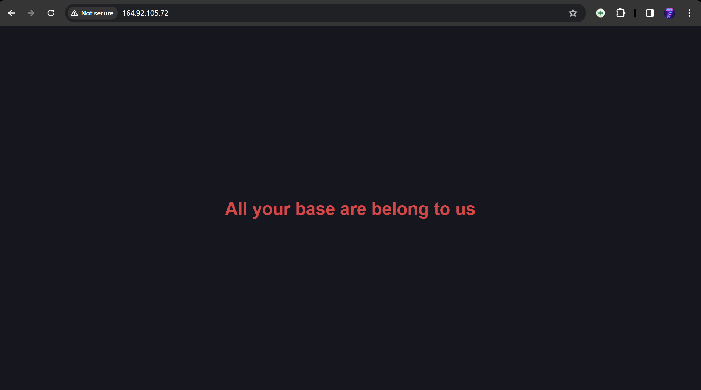

# tutorial that would take you from a fresh Arch Linux server running on DigitalOcean to serving the demo document.

# It is important to update your system evertime you start
```bash
sudo pacman -Syu
```

# Install Nginx, this command install Nginx if not installed
```bash
sudo pacman -S nginx
```

# Install Vim, This installs the vim if not installed
```bash
sudo pacman -S vim
```

# Start Nginx
```bash
sudo systemctl start nginx
```

# Enable Nginx
```bash
sudo systemctl enable nginx
```

# You could also check the status of Nginx
```bash
sudo systemctl status nginx
```
# Now Nginx is up and running 

# Now create a new directory "/web/html/nginx-2420" that will act as your project root. Here all website documents will be stored
```bash
mkdir -p /web/html/nginx-2420
```
# -p is used create the directory even if path does not exist.

# Now setup a separate server block "nginx-2420" for your new server.
# For using the sites-enabled and sites-available approach, create the following directories:
```bash
mkdir /etc/nginx/sites-available
mkdir /etc/nginx/sites-enabled
```

# after creating these, Create a file inside the sites-available directory that contains one or more server blocks
```bash
sudo vim /etc/nginx/sites-available/nginx-2420.conf
```

# inside this file write the following 
```bash
server {
    listen 80;

    server_name IP_address;

    location / {
        root /web/html/nginx-2420;
        index index.html;
    }
}
```
# instead of IP_address write your ip address

# Now append include sites-enabled/*; to the end of the http block of the nginx.conf file.
# This will make your html file work.
```bash
sudo vim /etc/nginx/nginx.conf
```
```bash
http {
    ...
    include sites-enabled/*;
}
```

# To enable a site, simply create a symlink
```bash
sudo ln -s /etc/nginx/sites-available/nginx-2420.conf /etc/nginx/sites-enabled/
```

# now for troubleshooting you can, do Configuration validation using 
# you should get ok and successful if you did everything properly
```bash
sudo nginx -t
```

# restart nginx now, to make the changes
```bash
sudo systemctl restart nginx
```

# now create the index.html file, which will create all the html content of the demo file
```bash
sudo vim /web/html/nginx-2420/index.html
```
```html
<!DOCTYPE html>
<html lang="en">
<head>
    <meta charset="UTF-8">
    <meta name="viewport" content="width=device-width, initial-scale=1.0">
    <title>2420</title>
    <style>
        * {
            color: #db4b4b;
            background: #16161e;
        }
        body {
            display: flex;
            align-items: center;
            justify-content: center;
            height: 100vh;
            margin: 0;
        }
        h1 {
            text-align: center;
            font-family: sans-serif;
        }
    </style>
</head>
<body>
    <h1>All your base are belong to us</h1>
</body>
</html>
```

# Now you are ready to go to your browser and look at the website.
# To do this you can simply search the ip address of your server on any web browser

# You will have something like this



